# Bank Meet - Infraestructure Frontend / Backend

## Tecnologías Utilizadas

* **Frontend:** Angular 18+ (Node 22)
* **Backend:** Spring Boot 3 (Java 21 / Maven)
* **Base de Datos:** PostgreSQL 15
* **Gestión de BD:** pgAdmin 4
* **Orquestación:** Docker Compose
---

## Arquitectura de Contenedores

Applicacion Web Bancaria.
Frontend / Clean Architecture
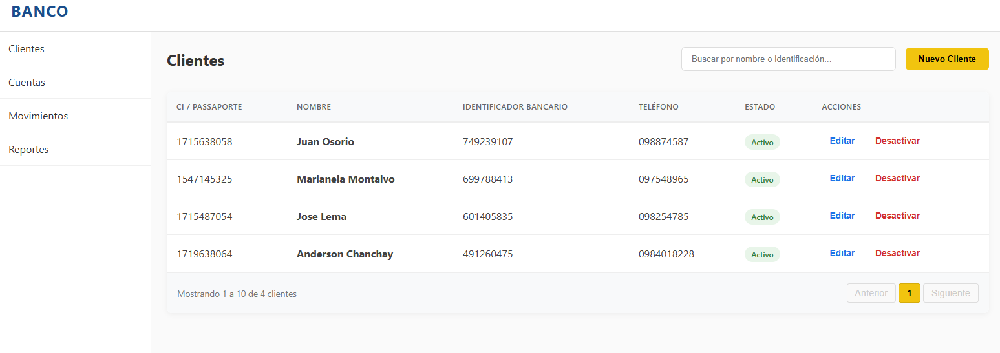
Backend / Hexagonal Architecture
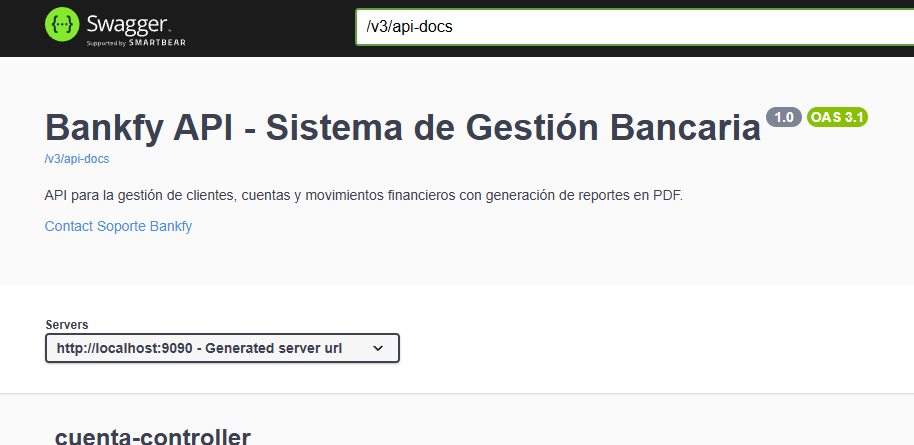
---
## Instrucciones de Ejecución

Sigue estos pasos para levantar el entorno de desarrollo:

Abre una terminal y ejecuta:
git clone https://github.com/ANDERSOUNDZ/DOCKER_TEST1.git

cd DOCKER_TEST1

Levantar los Servicios
---
Ejecuta el comando completo para construir las imágenes y levantar los contenedores en segundo plano:
---
docker-compose up --build

Servicios Desplegados

Una vez que Docker termine el proceso, podrás acceder a los siguientes servicios:

| Servicio      | URL / Acceso                                      | Puerto | Descripción                       |
|---------------|---------------------------------------------------|--------|-----------------------------------|
| Frontend      | http://localhost:4200/                            | 4200   | Interfaz de Usuario (Angular)     |
| BackendSwagger| http://localhost:9090/swagger-ui/index.html       | 9090   | API                               |
| pgAdmin       | http://localhost:5050/                            | 5050   | Panel de Gestión de BD            |
| Database      | localhost 5432                                    | 5432   | Motor PostgreSQL                  |

---

---
Configuración de pgAdmin (Visualizar BD)
---

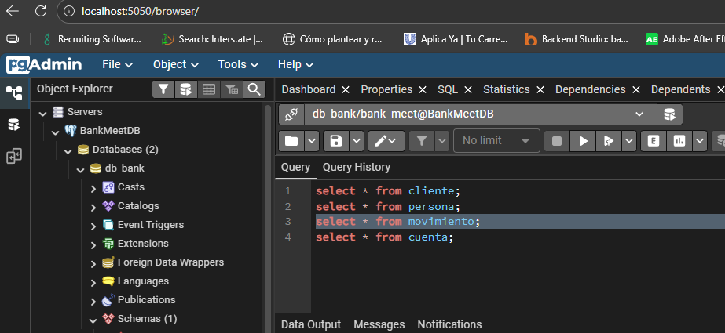

---
Para ver las tablas y datos en la interfaz visual, sigue estos pasos dentro de pgAdmin:

Inicia sesión con el correo y clave configurados en el compose
(admin@gmail.com / BankMeet2024!).

Haz clic derecho en Servers > Register > Server...

En la pestaña General:

Name: BankMeetDB

En la pestaña Connection:

Host name/address: db

Port: 5432

Maintenance database: db_bank

Username: bank_meet

Password: BankMeet2024!

Save Password: (Marcado)

-------
BANKFY TEST 1
-------

Funcionalidades Front End:

1. Los valores cuando son crédito son positivos, y los débitos son negativos. Debe almacenarse el saldo disponible en cada transacción dependiendo del tipo de movimiento. (suma o resta)

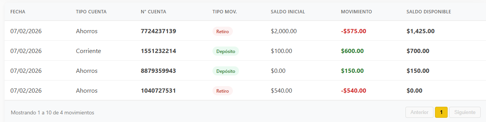

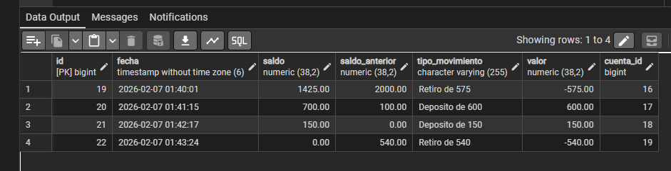

2. Si el saldo es cero, y va a realizar una transacción débito, debe desplegar mensaje "Saldo no disponible".
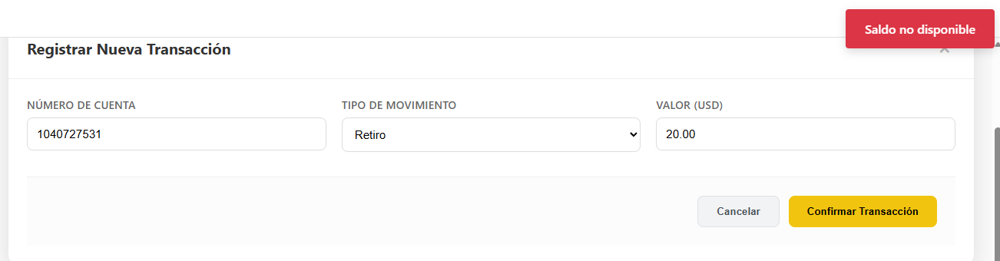
3. Se debe tener un parámetro de límite diario de retiro (valor tope 1000$)
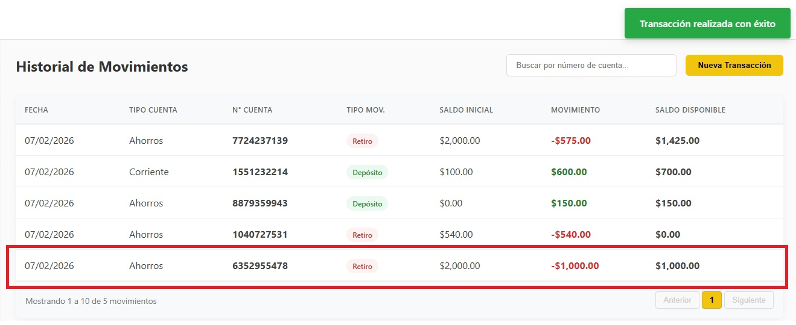
4. Si el cupo disponible ya se cumplió no debe permitir realizar un débito y debe desplegar el mensaje "Cupo diario Excedido"
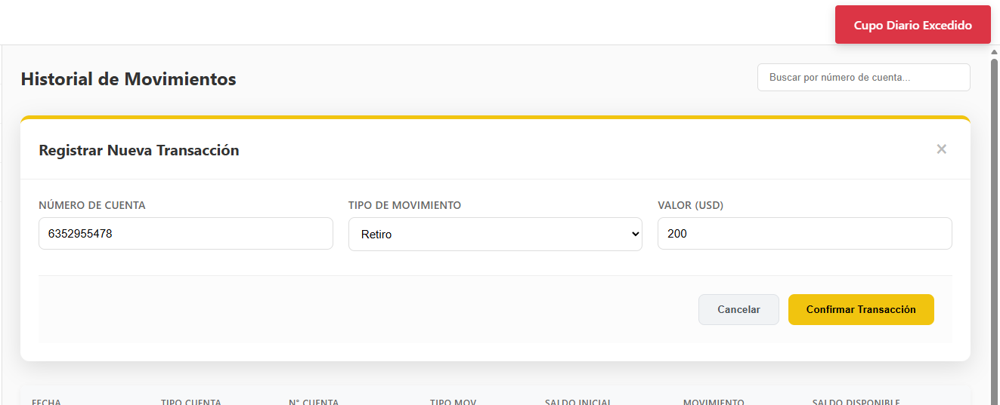
5. Generar reporte (Estado de cuenta) especificando un rango de fechas y un cliente, visualice las cuentas asociadas con sus respectivos saldos y el total de débitos y créditos realizados durante las fechas de ese cliente. Tomar en consideración que también se debe obtener los resultados del reporte en formato base64 (PDF) y Json. Por ejemplo: (/reportes?fecha rango fechas)
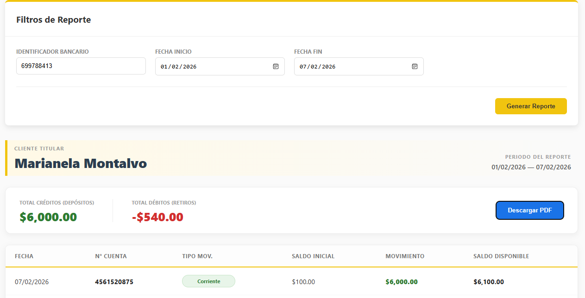
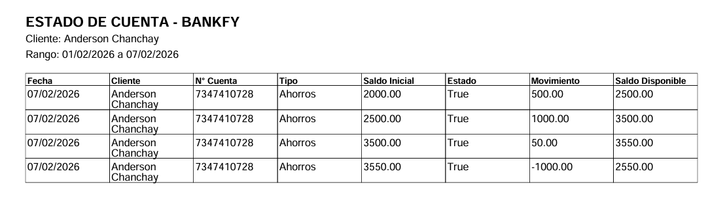

Funcionalidades Backend

1. Creacion de usuarios:
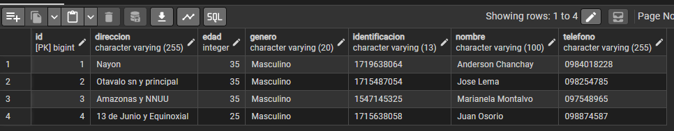
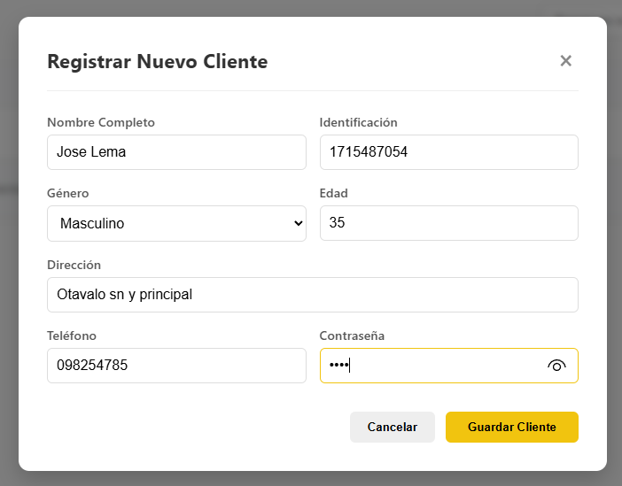
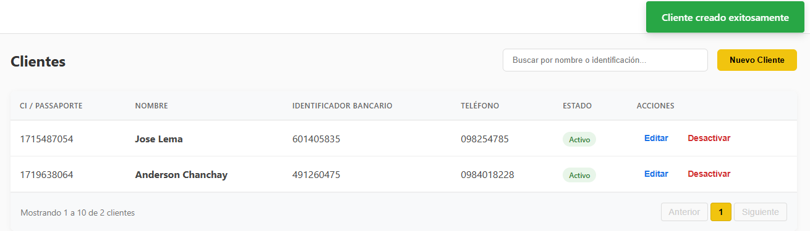

2. Creacion de Cuentas:
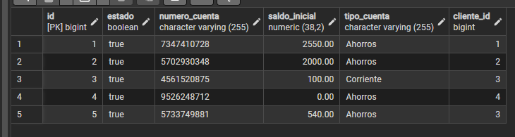
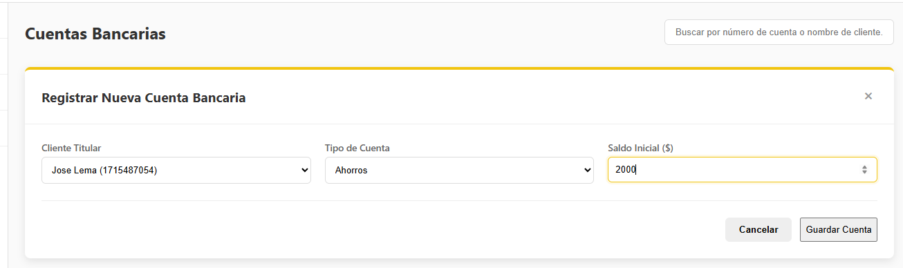
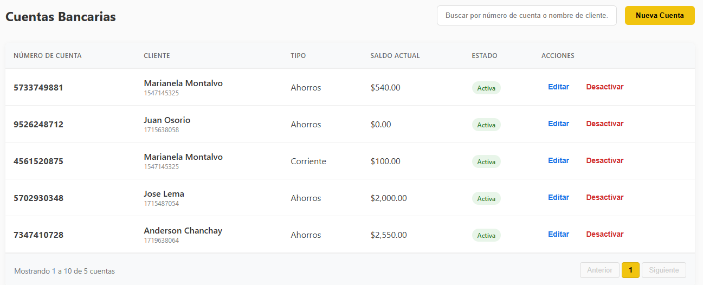

3. Creacion Cuenta corriente para Jose Lema:
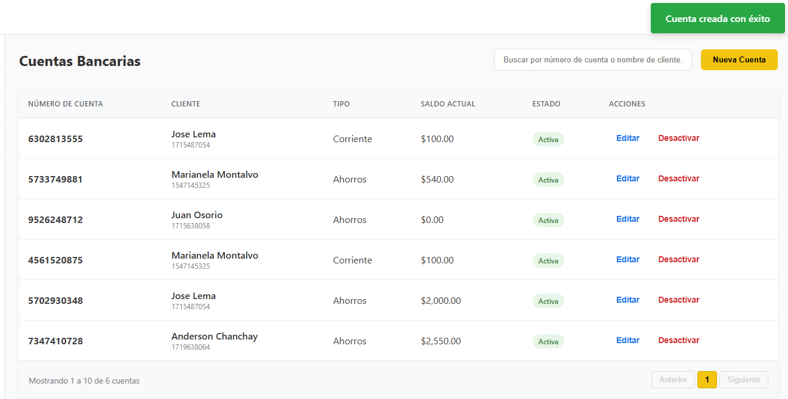

4. Realizar los movimientos:

5. Listado de Movimiento por fechas y por usuario descarga de pdf (vista)
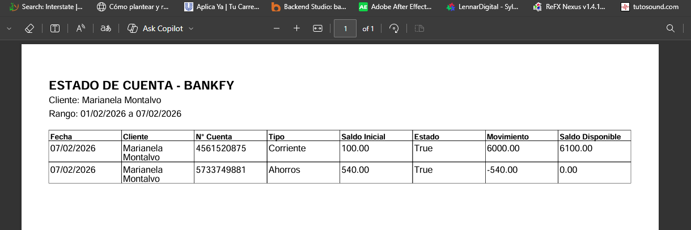
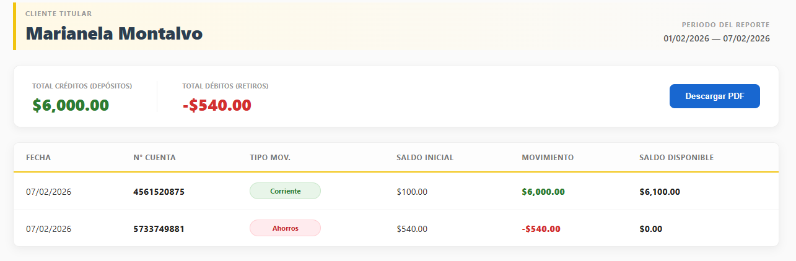
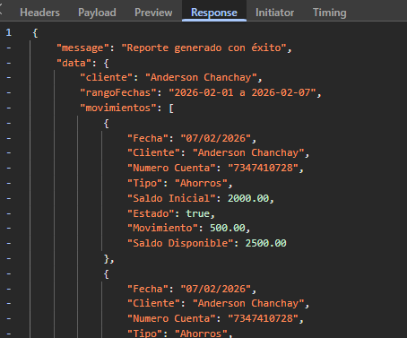

---
EndPoints
---

Cliente
---
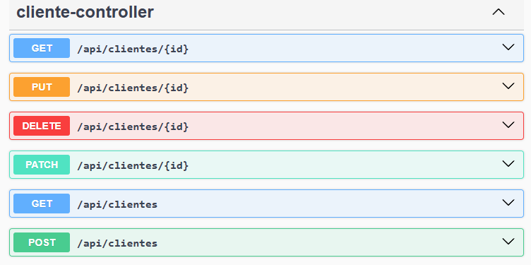

Cuenta
---
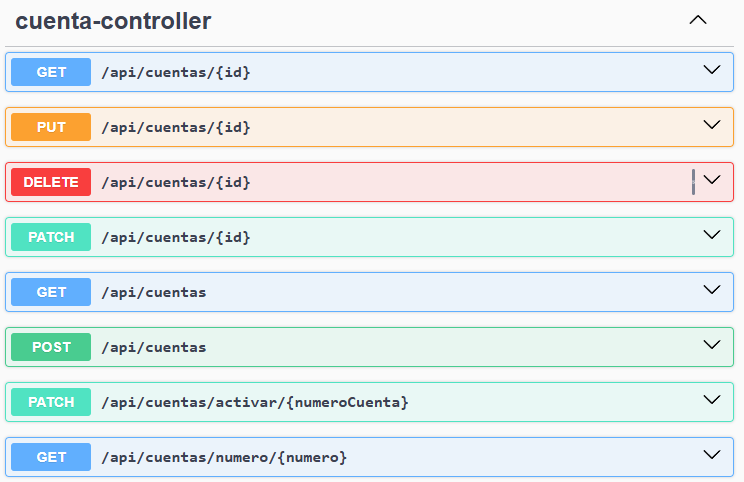

Movimiento
---
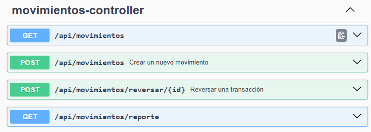

